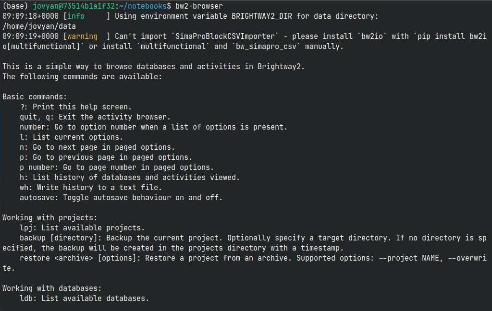
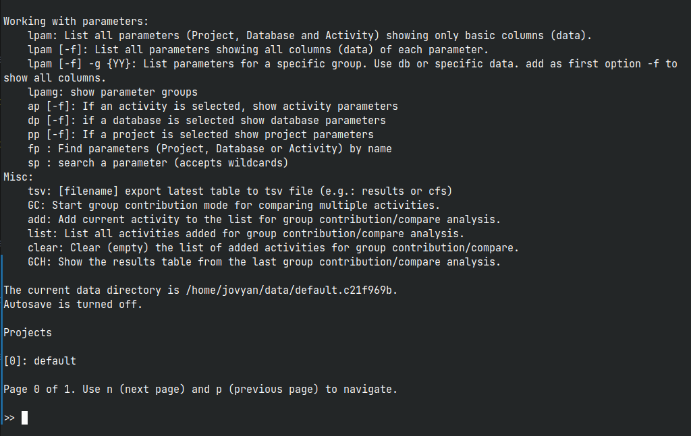

# Usage

This is a command-line utility to browse, search, and filter databases. When you’re ready to boss it around, grab the full lexicon in [the commands section](./commands.md) — it's the tool's secret diary, except it wants you to read it.

## Tool invocation

The package provides an executable script: ``bw2-browser`` (regardless of the installed package, [bw25ui](https://pypi.org/project/bw25ui/) or [bw2ui](https://pypi.org/project/bw2ui/).

The basic way to invoke the tool is:

```console
  bw2-browser
```
This will start it, and immediately list the available projects.




If you already know the project you want to start with, you can provide it as argument to the tool:

```console
  bw2-browser <project>
```

The same applies if you already know a database name or an activity id:

```console
  bw2-browser <project> <database>
```
```console
  bw2-browser <project> <database> <activity-id>
```

**Arguments**

+ ``project``

    Defines a project to start with

+ ``database``

    Defines a database to start with

+ ``activity-id``

    Defines an activity to start with


**Options**

  + ``-h`` ``--help``     
        Show help screen.

  + ``--version``     
        Show the current version of the tool.

